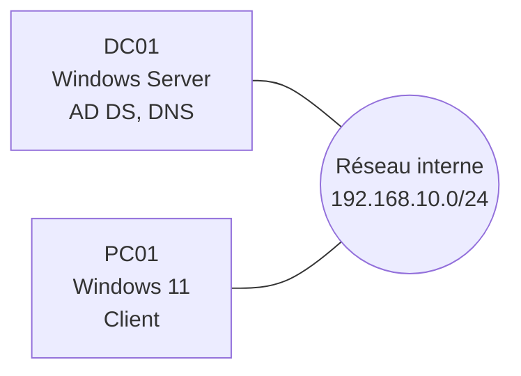

# Déploiement d'un domaine Active Directory

!!! note "Page d'exemple"
    Cette page montre la structure attendue pour un lab. Remplace chaque section par ton propre travail, puis supprime cet encadré.

| | |
|---|---|
| Date | Octobre 2026 |
| Durée | 6 heures |
| Dépôt | [lab-ad-windows-server](https://github.com/Walid924) |

## Contexte

Une PME fictive de 20 salariés veut centraliser la gestion de ses comptes utilisateurs et de ses postes.

## Objectifs

- Installer un contrôleur de domaine sous Windows Server
- Créer une arborescence d'unités d'organisation par service
- Appliquer des stratégies de groupe (verrouillage de session, lecteur réseau)
- Joindre un poste Windows 11 au domaine

## Architecture



| Machine | Système | Rôle | Adresse IP |
|---|---|---|---|
| DC01 | Windows Server | AD DS, DNS | 192.168.10.10 |
| PC01 | Windows 11 | Poste client | Attribuée par DHCP |

## Réalisation

### 1. Installation du rôle AD DS

Décris l'étape, puis ajoute une capture :

<!--  -->

### 2. Création des unités d'organisation

```powershell
New-ADOrganizationalUnit -Name "Comptabilite" -Path "DC=lab,DC=local"
```

### 3. Stratégies de groupe

Décris chaque GPO : son objectif, où elle est liée, ce qu'elle configure.

## Tests et validation

- Connexion d'un utilisateur du domaine sur PC01
- Vérification des GPO appliquées avec `gpresult /r`

## Problèmes rencontrés

Décris une erreur réelle : le symptôme, ton diagnostic, la solution. C'est la section la plus lue par un recruteur.

## Ce que j'ai appris

- Point concret 1
- Point concret 2

## Compétences mobilisées

Active Directory, DNS, GPO, Windows Server, PowerShell, virtualisation.
