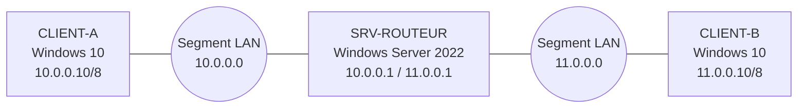
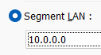
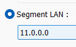
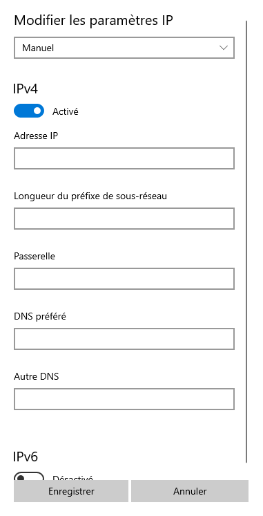
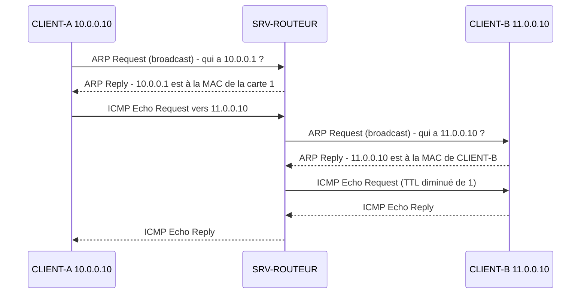

# Routage entre deux réseaux avec Windows Server 2022

<!--
  À COMPLÉTER AVANT PUBLICATION
  - Date et durée réelles
  - Les captures restantes (lignes ![...] commentées ci-dessous)
  - Les sections « Problèmes rencontrés » et « Bilan personnel »
  Puis supprime ce commentaire.
-->

| | |
|---|---|
| Date | Mois année |
| Durée | x heures |
| Environnement | Machines virtuelles VMware, configuration 100 % par interfaces graphiques |

## Contexte

Deux réseaux distincts, 10.0.0.0 et 11.0.0.0, doivent pouvoir communiquer. Aucun équipement réseau dédié n'est disponible : un serveur Windows Server 2022 équipé de deux cartes réseau joue le rôle de routeur entre les deux.

## Objectifs

- Définir un plan d'adressage et configurer les trois machines
- Activer le routage sur Windows Server 2022
- Lire et comprendre la table de routage
- Observer le protocole ARP pendant un ping entre les deux réseaux

## Architecture

### Plan d'adressage

| Machine | Système | Carte réseau | Segment LAN | Adresse IP | Masque | Passerelle |
|---|---|---|---|---|---|---|
| CLIENT-A | Windows 10 | Carte 1 | 10.0.0.0 | 10.0.0.10 | 255.0.0.0 (/8) | 10.0.0.1 |
| SRV-ROUTEUR | Windows Server 2022 | Carte 1 | 10.0.0.0 | 10.0.0.1 | 255.0.0.0 (/8) | Aucune |
| SRV-ROUTEUR | Windows Server 2022 | Carte 2 | 11.0.0.0 | 11.0.0.1 | 255.0.0.0 (/8) | Aucune |
| CLIENT-B | Windows 10 | Carte 1 | 11.0.0.0 | 11.0.0.10 | 255.0.0.0 (/8) | 11.0.0.1 |

Chaque client a pour passerelle l'adresse du routeur **dans son propre réseau**. C'est vers elle qu'il envoie tout paquet destiné à un autre réseau.

## Réalisation

### 1. Création des réseaux dans VMware

Chaque réseau est un **segment LAN** VMware : un réseau virtuel isolé, qui ne relie que les machines qu'on y branche. Dans les paramètres de chaque carte réseau virtuelle, l'option « Segment LAN » est choisie avec le segment correspondant.

| Segment du réseau A | Segment du réseau B |
|---|---|
|  |  |

| Machine | Carte 1 | Carte 2 |
|---|---|---|
| CLIENT-A | Segment 10.0.0.0 | |
| SRV-ROUTEUR | Segment 10.0.0.0 | Segment 11.0.0.0 |
| CLIENT-B | Segment 11.0.0.0 | |

Les deux clients ne partagent aucun segment : ils ne peuvent communiquer qu'en passant par le serveur.

### 2. Configuration IP des clients

Sur chaque client Windows 10 : **Paramètres > Réseau et Internet > Ethernet**, puis **Modifier** dans « Attribution d'adresse IP ». Le mode passe de « Automatique (DHCP) » à **Manuel**, et IPv4 est activé.

{ width="300" }

| Champ | CLIENT-A | CLIENT-B |
|---|---|---|
| Adresse IP | 10.0.0.10 | 11.0.0.10 |
| Longueur du préfixe de sous-réseau | 8 | 8 |
| Passerelle | 10.0.0.1 | 11.0.0.1 |
| DNS préféré | Vide (inutile pour ce lab) | Vide |

La **longueur du préfixe** remplace le masque : 8 signifie que les 8 premiers bits identifient le réseau, soit un masque 255.0.0.0.

### 3. Configuration IP du serveur

Sur le serveur, dans **Panneau de configuration > Centre Réseau et partage > Modifier les paramètres de la carte**, chaque carte est configurée via **Propriétés > Protocole Internet version 4 (TCP/IPv4)**.

| Champ | Carte 1 (réseau A) | Carte 2 (réseau B) |
|---|---|---|
| Adresse IP | 10.0.0.1 | 11.0.0.1 |
| Masque de sous-réseau | 255.0.0.0 | 255.0.0.0 |
| Passerelle par défaut | Vide | Vide |

Le serveur **est** la passerelle : il n'en a pas besoin pour ces deux réseaux, qu'il touche directement.

<!--  -->

### 4. Installation du rôle Routage

Dans le **Gestionnaire de serveur** :

1. **Gérer > Ajouter des rôles et fonctionnalités**
2. Type d'installation : **Installation basée sur un rôle ou une fonctionnalité**
3. Rôle : **Accès à distance**
4. Services de rôle : **Routage** (l'assistant ajoute automatiquement « DirectAccess et VPN (RAS) », nécessaire au fonctionnement)
5. **Installer**

<!--  -->

### 5. Activation du routage

Dans le Gestionnaire de serveur : **Outils > Routage et accès distant**.

1. Clic droit sur le serveur, puis **Configurer et activer le routage et l'accès distant**
2. Choix de **Configuration personnalisée**
3. Case **Routage LAN** cochée
4. **Terminer**, puis **Démarrer le service**

Le serveur passe au vert dans la console : le routage est actif.

<!--  -->

!!! info "Faut-il un protocole de routage ?"
    Les deux réseaux sont directement connectés au serveur : il les connaît dès que ses cartes sont adressées, sans protocole de routage ni route statique. Un protocole dynamique (RIP, OSPF) ou des routes statiques deviennent nécessaires dès qu'un réseau se trouve derrière un autre routeur.

### 6. Autorisation du ping sur les clients

<!-- Supprime cette étape si tu n'as pas eu besoin de la faire. -->

Par défaut, le pare-feu de Windows 10 bloque les demandes de ping entrantes. Sur chaque client : **Pare-feu Windows Defender avec fonctions avancées de sécurité > Règles de trafic entrant**, puis clic droit sur **Partage de fichiers et d'imprimantes (Demande d'écho - Trafic entrant ICMPv4)** et **Activer la règle**.

## Table de routage

Dans la console Routage et accès distant : **IPv4 > Général**, clic droit, puis **Afficher la table de routage IP**.

<!--  -->

Les lignes importantes :

| Destination | Masque réseau | Interface | Protocole | Signification |
|---|---|---|---|---|
| 10.0.0.0 | 255.0.0.0 | Carte 1 | Local | Réseau A, directement connecté |
| 11.0.0.0 | 255.0.0.0 | Carte 2 | Local | Réseau B, directement connecté |

« Local » signifie que le serveur a appris la route tout seul, parce que l'un de ses réseaux est branché sur cette carte. Quand un paquet arrive pour 11.0.0.10, le serveur consulte cette table, trouve que 11.0.0.0/8 est derrière la carte 2, et l'envoie par là.

Côté clients, c'est la passerelle qui fait le travail : tout paquet qui n'est pas destiné à leur propre réseau est envoyé au serveur.

## Observation du protocole ARP

### Méthode

1. Sur le serveur, lancer **Wireshark** sur les deux cartes réseau, avec le filtre d'affichage `arp or icmp`
2. Sur CLIENT-A, désactiver puis réactiver la carte réseau, pour vider les correspondances IP/MAC déjà connues
3. Lancer un ping de CLIENT-A vers CLIENT-B (11.0.0.10)
4. Observer les trames capturées de chaque côté du routeur

### Ce qui se passe

<!--  -->
<!--  -->

CLIENT-A voit que 11.0.0.10 n'est pas dans son réseau. Il ne cherche donc pas l'adresse MAC de CLIENT-B, mais celle de sa **passerelle**. Le routeur fait ensuite sa propre requête ARP, côté réseau B, pour trouver CLIENT-B.

| | Trame sur le réseau A | Trame sur le réseau B |
|---|---|---|
| IP source | 10.0.0.10 | 10.0.0.10 |
| IP destination | 11.0.0.10 | 11.0.0.10 |
| MAC source | CLIENT-A | Carte 2 du serveur |
| MAC destination | Carte 1 du serveur | CLIENT-B |

Les adresses IP restent les mêmes de bout en bout, alors que les adresses MAC changent à chaque réseau traversé. C'est le cœur du routage : l'IP désigne la destination finale, la MAC désigne seulement le prochain équipement.

## Tests et validation

- [ ] Ping de CLIENT-A vers CLIENT-B : réponses reçues
- [ ] Ping de CLIENT-B vers CLIENT-A : réponses reçues
- [ ] Table de routage du serveur : les deux réseaux présents en « Local »
- [ ] Wireshark : ARP vers la passerelle côté A, ARP vers CLIENT-B côté B

## Problèmes rencontrés

<!--
  Décris un vrai problème : le symptôme, ton diagnostic, la solution.
  Exemples fréquents sur ce TP : ping bloqué par le pare-feu, passerelle oubliée,
  carte réseau branchée sur le mauvais segment LAN, service de routage non démarré.
-->

Symptôme, diagnostic, solution.

## Bilan personnel

### Ce que j'ai compris

<!-- Avec tes mots : le rôle de la passerelle, pourquoi la MAC change et pas l'IP... -->

### Ce qui m'a donné envie d'aller plus loin

<!-- Par exemple : les protocoles de routage dynamique (RIP, OSPF), le routage sur Cisco, le CCNA... -->

### Ce que je pourrais améliorer

<!--
  Pistes possibles :
  - Utiliser des plages privées (le réseau 11.0.0.0 est une plage publique, réservée sur Internet)
  - Utiliser des masques plus adaptés, par exemple en /24
  - Ajouter un second routeur pour mettre en place du routage statique ou RIP
-->

## Compétences mobilisées

Adressage IPv4, routage, Windows Server 2022, rôle Routage et accès distant, ARP, ICMP, Wireshark, VMware.
