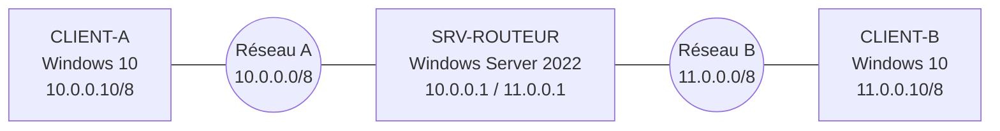
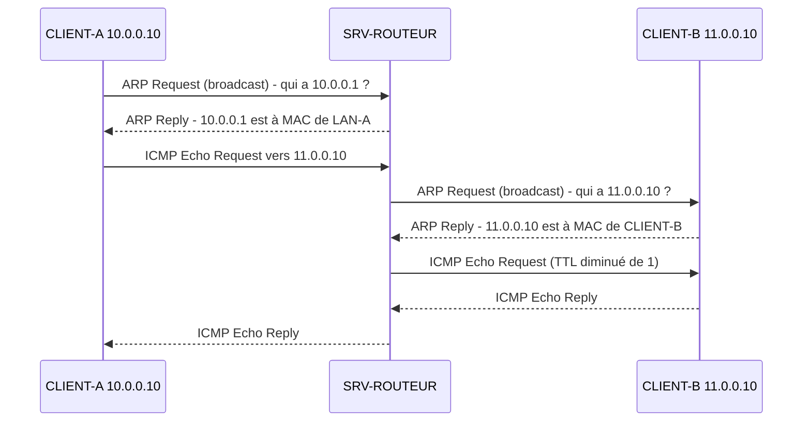

# Routage entre deux réseaux avec Windows Server 2022

<!--
  À COMPLÉTER AVANT PUBLICATION
  - Date et durée réelles
  - Tes captures d'écran (lignes ![...] commentées ci-dessous)
  - Tes résultats réels (adresses MAC, sorties de commandes)
  - Les sections « Problèmes rencontrés » et « Bilan personnel »
  Puis supprime ce commentaire.
-->

| | |
|---|---|
| Date | Mois année |
| Durée | x heures |
| Environnement | Machines virtuelles (VMware ou VirtualBox) |

## Contexte

Deux réseaux distincts, 10.0.0.0 et 11.0.0.0, doivent pouvoir communiquer. Aucun équipement réseau dédié n'est disponible : un serveur Windows Server 2022 équipé de deux cartes réseau joue le rôle de routeur entre les deux.

## Objectifs

- Définir un plan d'adressage et configurer les trois machines
- Activer le routage sur Windows Server 2022
- Lire et comprendre la table de routage
- Observer le protocole ARP pendant un ping entre les deux réseaux

## Architecture



### Plan d'adressage

| Machine | Système | Interface | Adresse IP | Masque | Passerelle |
|---|---|---|---|---|---|
| CLIENT-A | Windows 10 | Ethernet | 10.0.0.10 | 255.0.0.0 | 10.0.0.1 |
| SRV-ROUTEUR | Windows Server 2022 | LAN-A | 10.0.0.1 | 255.0.0.0 | Aucune |
| SRV-ROUTEUR | Windows Server 2022 | LAN-B | 11.0.0.1 | 255.0.0.0 | Aucune |
| CLIENT-B | Windows 10 | Ethernet | 11.0.0.10 | 255.0.0.0 | 11.0.0.1 |

Chaque client a pour passerelle l'adresse du routeur **dans son propre réseau**. C'est vers elle qu'il envoie tout paquet destiné à un autre réseau.

### Réseau virtuel

Dans l'hyperviseur, chaque réseau est un segment isolé :

- CLIENT-A et la carte LAN-A du serveur sont sur le segment « Réseau A »
- CLIENT-B et la carte LAN-B du serveur sont sur le segment « Réseau B »

Les deux clients ne partagent aucun segment : ils ne peuvent communiquer qu'en passant par le serveur.

## Réalisation

### 1. Configuration des adresses IP

Sur le serveur, les deux cartes sont d'abord renommées pour savoir à quel réseau chacune appartient, puis adressées :

```powershell
Rename-NetAdapter -Name "Ethernet0" -NewName "LAN-A"
Rename-NetAdapter -Name "Ethernet1" -NewName "LAN-B"

New-NetIPAddress -InterfaceAlias "LAN-A" -IPAddress 10.0.0.1 -PrefixLength 8
New-NetIPAddress -InterfaceAlias "LAN-B" -IPAddress 11.0.0.1 -PrefixLength 8
```

Sur les clients, l'adresse, le masque et la passerelle sont saisis dans les propriétés IPv4 de la carte réseau (voir le plan d'adressage).

<!--  -->

Vérification sur chaque machine :

```
ipconfig
```

### 2. Autorisation du ping

Par défaut, le pare-feu de Windows bloque les demandes d'écho ICMP entrantes. Sur les deux clients, la règle prévue à cet effet est activée :

```powershell
Enable-NetFirewallRule -Name "FPS-ICMP4-ERQ-In"
```

### 3. Activation du routage sur le serveur

Le routage est fourni par le rôle **Accès à distance**, service de rôle **Routage** :

```powershell
Install-WindowsFeature Routing -IncludeManagementTools
```

Il est ensuite activé depuis la console « Routage et accès distant » : clic droit sur le serveur, « Configurer et activer le routage et l'accès distant », « Configuration personnalisée », puis « Routage LAN ». Le service est démarré à la fin de l'assistant.

<!--  -->

Vérification que le serveur transfère bien les paquets entre ses interfaces :

```powershell
Get-NetIPInterface -AddressFamily IPv4 | Select-Object InterfaceAlias, Forwarding
```

Les interfaces LAN-A et LAN-B doivent afficher `Enabled`.

!!! info "Faut-il un protocole de routage ?"
    Les deux réseaux sont directement connectés au serveur : il les connaît dès que ses cartes sont adressées, sans protocole de routage ni route statique. Un protocole dynamique (RIP, OSPF) ou des routes statiques deviennent nécessaires dès qu'un réseau se trouve derrière un autre routeur.

### 4. Table de routage

Sur le serveur :

```
route print -4
```

<!--  -->

Les lignes importantes :

| Destination | Masque | Passerelle | Interface | Signification |
|---|---|---|---|---|
| 10.0.0.0 | 255.0.0.0 | On-link | 10.0.0.1 | Réseau A, directement connecté à LAN-A |
| 11.0.0.0 | 255.0.0.0 | On-link | 11.0.0.1 | Réseau B, directement connecté à LAN-B |

« On-link » signifie que la destination est joignable directement sur l'interface, sans passer par un autre routeur.

Sur CLIENT-A, la route par défaut `0.0.0.0` pointe vers la passerelle 10.0.0.1 : tout ce qui n'est pas dans 10.0.0.0/8 est envoyé au serveur.

### 5. Test de connectivité

Depuis CLIENT-A :

```
ping 11.0.0.10
tracert 11.0.0.10
```

Le `tracert` montre le passage par le routeur : un premier saut vers 10.0.0.1, puis l'arrivée sur 11.0.0.10.

<!--  -->

## Observation du protocole ARP

### Méthode

1. Vider le cache ARP de CLIENT-A et du serveur (invite de commandes en administrateur) : `arp -d *`
2. Lancer une capture Wireshark sur les deux cartes du serveur (LAN-A et LAN-B), avec le filtre `arp or icmp`
3. Depuis CLIENT-A : `ping -n 1 11.0.0.10`
4. Afficher le cache ARP de CLIENT-A : `arp -a`

### Ce qui se passe



<!--  -->
<!--  -->

CLIENT-A voit que 11.0.0.10 n'est pas dans son réseau. Il ne cherche donc pas l'adresse MAC de CLIENT-B, mais celle de sa **passerelle**. Le routeur fait ensuite sa propre requête ARP, côté réseau B, pour trouver CLIENT-B.

| | Trame sur le réseau A | Trame sur le réseau B |
|---|---|---|
| IP source | 10.0.0.10 | 10.0.0.10 |
| IP destination | 11.0.0.10 | 11.0.0.10 |
| MAC source | CLIENT-A | LAN-B du serveur |
| MAC destination | LAN-A du serveur | CLIENT-B |

Les adresses IP restent les mêmes de bout en bout, alors que les adresses MAC changent à chaque réseau traversé. C'est le cœur du routage : l'IP désigne la destination finale, la MAC désigne seulement le prochain équipement.

Le cache ARP de CLIENT-A le confirme : après le ping, il contient l'adresse MAC de 10.0.0.1, mais **pas** celle de 11.0.0.10.

<!--  -->

## Tests et validation

- [ ] `ping 11.0.0.10` depuis CLIENT-A : réponses reçues
- [ ] `ping 10.0.0.10` depuis CLIENT-B : réponses reçues
- [ ] `tracert` : passage par la passerelle visible
- [ ] Table de routage du serveur : les deux réseaux en « On-link »
- [ ] Cache ARP de CLIENT-A : MAC de la passerelle uniquement

## Problèmes rencontrés

<!--
  Décris un vrai problème : le symptôme, ton diagnostic, la solution.
  Exemples fréquents sur ce TP : ping bloqué par le pare-feu, passerelle oubliée,
  carte réseau branchée sur le mauvais segment, service de routage non démarré.
-->

Symptôme, diagnostic, solution.

## Bilan personnel

### Ce que j'ai compris

<!-- Avec tes mots : le rôle de la passerelle, pourquoi la MAC change et pas l'IP... -->

### Ce qui m'a donné envie d'aller plus loin

<!-- Par exemple : les protocoles de routage dynamique (RIP, OSPF), le routage sur Cisco, le CCNA... -->

### Ce que je pourrais améliorer

<!--
  Pistes possibles :
  - Utiliser des plages privées (le réseau 11.0.0.0 est une plage publique, réservée sur Internet)
  - Utiliser des masques plus adaptés, par exemple en /24
  - Ajouter un second routeur pour mettre en place du routage statique ou RIP
  - Automatiser la configuration avec un script PowerShell
-->

## Compétences mobilisées

Adressage IPv4, routage, Windows Server 2022, rôle Routage et accès distant, ARP, ICMP, Wireshark, PowerShell, virtualisation.
